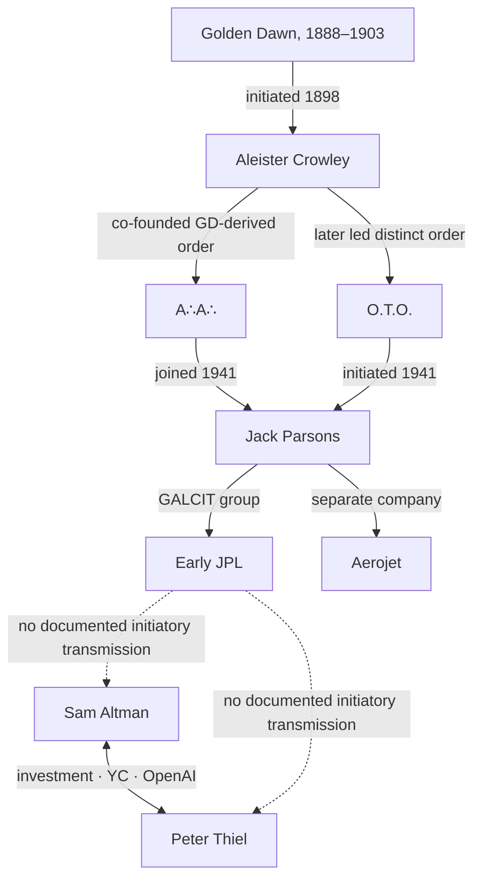

# The Golden Dawn / Tech-Elite Connection Audit

## Sam Altman, Peter Thiel, elite membership, successor orders, and the strongest documented occult–technology bridge

**Research date:** 31 July 2026  
**Status:** Evidence dossier, version 1  
**Subject:** The Hermetic Order of the Golden Dawn, not the Greek political party  

COO no rights reserved 
---

## Executive finding

The evidence does **not** support a hidden organizational line from the Hermetic Order of the Golden Dawn to Sam Altman, Peter Thiel, OpenAI, Palantir, World, Y Combinator, Dialog, JPL, NASA, or the modern technology sector as a whole.

It supports three narrower findings:

1. **The original Golden Dawn included some influential, wealthy, titled, military, scientific, and cultural figures.** It was nevertheless a small, predominantly middle-class initiatory society—not a demonstrated aristocratic or state command structure.
2. **Sam Altman and Peter Thiel have a direct, documented professional and financial relationship.** Thiel invested in Altman’s venture fund, joined Y Combinator as a part-time partner under Altman, and was named among OpenAI’s launch donors.
3. **A genuine occult-to-technology bridge exists, but it runs through particular people and stops well before Altman or Thiel:**

> Golden Dawn → Aleister Crowley → A∴A∴ (derived) and Crowley-led O.T.O. (distinct) → Jack Parsons → the early rocket group that became JPL  
> Jack Parsons and fellow GALCIT members → the separately founded Aerojet company

That chain establishes personal and curricular transmission through later, distinct occult institutions into one consequential rocket engineer’s life. It does **not** establish Golden Dawn control of JPL, NASA, Silicon Valley, AI, or later firms.

### Bottom-line matrix

| Proposition | Finding | Evidence status |
|---|---|---|
| Golden Dawn was an elite ruling order | A few elite participants; membership overall was predominantly middle class; no evidence of collective state or financial command | **Partly true, usually overstated** |
| Altman was/is Golden Dawn, Thelemic, O.T.O., A∴A∴, Rosicrucian, or Masonic | No credible public evidence located | **Not documented** |
| Thiel was/is Golden Dawn, Thelemic, O.T.O., A∴A∴, B.O.T.A., or in another derived initiatory order | No credible public evidence located | **Not documented** |
| Altman and Thiel are directly connected | Investment, mentorship, YC partnership, and OpenAI launch support | **Confirmed** |
| Golden Dawn influenced Crowley | Crowley was formally initiated and advanced into the Inner Order | **Confirmed** |
| Crowley transmitted Golden-Dawn-derived material into A∴A∴ and reshaped O.T.O. | Documentary and scholarly record | **Confirmed, with institutional distinctions** |
| Jack Parsons belonged to Crowley’s O.T.O. and A∴A∴ | Initiation, correspondence, and lodge records | **Confirmed** |
| Parsons helped found the technical group that became JPL and helped found Aerojet | JPL, Caltech, and scholarly histories | **Confirmed** |
| Therefore Golden Dawn founded or controlled JPL/NASA | The inference exceeds the evidence | **Unsupported** |
| “Covenant,” the World Orb, “Feel the AGI,” an effigy burning, Palantir, Dialog, or “adept” language prove Golden Dawn provenance | No lineage document, teacher, initiation, funding record, or acknowledged borrowing closes the route | **Motif/adjacency only** |

---

## 1. Scope and proof rules

“All the elite associated with Golden Dawn” is too loose to audit literally. The surviving membership roll contains many people, not all of whom were influential and not all of whom stayed active. This report therefore covers:

- the founders and governing adepts;
- historically consequential confirmed members;
- confirmed wealthy, titled, scientific, military, or political participants;
- direct institutional descendants and major transmission figures;
- the strongest Golden-Dawn-to-technology route;
- Sam Altman, Peter Thiel, and the immediate nodes required to test proposed routes;
- famous pseudo-members and seductive modern false positives.

The [Sally Davis membership-roll dataset](https://zenodo.org/records/10938903), based on R. A. Gilbert’s transcription and inspection of the surviving original roll, remains the better starting point for anyone who needs every recorded London, Bradford, and Edinburgh initiate from 1888–1901. Its scope does not include every Paris or Weston-super-Mare record.

### Relationship classes

These letters classify the **kind of connection**, not the overall confidence of a claim.

| Grade | Meaning | Minimum evidence |
|---|---|---|
| A | Confirmed original member | Original roll, grade certificate, temple record, or contemporary order correspondence |
| B | Direct patron or officer | Financial account, office record, charter, or contemporaneous correspondence |
| C | Direct institutional descendant | Documented split or transfer through original Golden Dawn members |
| D | Successor-line member | Documented initiation into a descendant after the classical order |
| E | Intellectual or ritual influence | Identifiable borrowed text, curriculum, rite, teacher, or acknowledged source |
| F | Direct external relationship | Financial, professional, institutional, personal, or self-authored public record |
| G | Network adjacency | A documented relationship that does not itself transmit the relevant doctrine or membership |
| H | Structural analogy or motif | Similar language, imagery, hierarchy, ritual, or aspiration without provenance |
| X | Unsupported | No adequate record, or a route that depends on association alone |

For a modern affiliation claim, the needed evidence would be a roster, initiation record, correspondence, payment or donation, named teacher, self-identification, ritual document, or credible witness account. A sphere, eye, chant, secretive meeting, use of the word *adept*, interest in immortality, or friendship with someone who read Crowley does not meet that standard.

Negative findings in this dossier mean **not documented in the reviewed public record**. They do not pretend to prove that no private contact could ever have happened.

---

## 2. What the supplied corpus actually says

The eight supplied files contain no occurrence of **Golden Dawn, Crowley, Thelema, O.T.O., Hermetic**, or **adept** in the relevant occult sense. The spreadsheet likewise contains no matching historical or modern affiliation record.

The only direct Altman/Thiel treatment is in `SATIRE_TECH_PRIEST(1).md`. That file expressly says it does not allege secret coordination, hidden cult membership, blood guilt, criminal conduct, or personal evil. It treats both men as public **role-functions**:

- Thiel: capital-sovereignty architect, private-room calendar keeper, apocalyptic anti-regulation theologian;
- Altman: abundance priest, world-brain builder, benevolent scale steward.

Those are satirical institutional diagnoses, not membership claims.

### What each supplied source contributes

| Supplied file | Valid use here | Invalid use |
|---|---|---|
| `FIELD_NOTES_7_27_26(1).md` | Detecting self-sealing conspiracy narratives and cross-domain attractors | Treating a model’s repeating “hidden operator” story as evidence |
| `V2.3 THE 2026 WOBBLE DIAGNOSTIC(4).pdf` | Material-stress and falsification method; calendar as mnemonic, not cause | Making symbolic timing causal |
| `Silicon_God_Necropolis_Provenance_Refusal_v1(3)(1).pdf` | “Priesthood-function” as a functional institutional role | Turning the function into a bloodline, soul claim, or unified hidden actor |
| `SATIRE_TECH_PRIEST(1).md` | Role-function satire about access, consent, private rooms, and future custody | Hidden-cult allegation |
| `Revelation_Empire_Necropolis_Integrated_v4(2)(1).md` | Null model, invocation/operation split, cross-packet firewall, evidence lanes | Shared symbolism as shared agency |
| `FOSSILIZED_MONKEY_POLITICS(13)(1).md` | Priesthood capture, symbolic monopoly, ritual inflation, interpretive chokepoints | Assuming every mediator belongs to one conspiracy |
| `monkey_myth_matrix_v0_20(2)(1).xlsx` | Tiering, counterexamples, poor-fit tests, and the question “Can a row fail?” | A prebuilt Golden Dawn evidence base |
| `Revelation-Consolidated(4).md` | Function-first interpretation and refusal of named-person prophecy roles | Person-by-person occult casting |

The corpus’s governing rule is exactly right for this subject:

> Cross-packet links may share a material substrate. They may not inherit shared agency without direct evidence.

Accordingly, the report separates **membership, succession, influence, adjacency, and resemblance**.

---

## 3. What the Golden Dawn was

The classical Hermetic Order of the Golden Dawn operated from 1888 to 1903. Egil Asprem’s [Cambridge Handbook chapter](https://www.cambridge.org/core/books/abs/cambridge-handbook-of-western-mysticism-and-esotericism/golden-dawn-and-the-oto/89C65341BF3D3912E35E25A6F3759B07) calls it the pivotal esoteric order of fin-de-siècle Britain and identifies four English temples and one in Paris. It converted ritual magic from a largely private practice into an institutional curriculum.

The founders were William Wynn Westcott, Samuel Liddell MacGregor Mathers, and William Robert Woodman. All three came out of the Societas Rosicruciana in Anglia, a Masonic Rosicrucian body. The [Museum of Freemasonry archive account](https://www.exploreyourarchive.org/the-hermetic-order-of-the-golden-dawn-secrets-at-the-museum-of-freemasonry/) confirms the founders, the cipher-based initiation curriculum, and the development of a secret Inner Order.

### Outer Order, Inner Order, and “adept”

The Outer Order taught a graded synthesis of Qabalah, astrology, alchemical symbolism, geomancy, tarot, and related subjects. Mathers compiled practical magical material for the Inner Order, formally the *Ordo Rosae Rubeae et Aureae Crucis*, established in the early 1890s.

**“Adept” was the category or general noun for Inner Order members, not one formal rank.** Adeptus Minor 5=6 was the first formal Inner Order grade after completion of the Outer grades; Adeptus Major 6=5 and Adeptus Exemptus 7=4 were higher adept grades. The notation maps positions on the Kabbalistic Tree of Life; the numbers are not an arithmetic score.

This resolves any modern “adept class” claim:

> A model, interviewer, founder, or online group can use Golden-Dawn-like adept language. It cannot confer a Golden Dawn grade. Without an order, induction, curriculum, witnesses, and record, “adept” is rhetoric or analogy—not membership.

### The “Secret Chiefs” and the order’s origin legend

Westcott claimed that a German adept, Fräulein Anna Sprengel, had authorized the English temple through correspondence after his purported decoding of the cipher manuscripts. These are distinct evidentiary objects: the cipher manuscript’s provenance remains disputed and is often traced to Kenneth Mackenzie or earlier sources; the Sprengel letters and authorization are separately and widely suspected of fabrication by Westcott. The Museum of Freemasonry explains how the claimed authorization supplied the new order with a legitimate pedigree.

That disputed story matters structurally. It placed ultimate authorization in a remote and difficult-to-audit source, while local officers interpreted the source and administered access. In the supplied corpus’s language, that is a strong **priesthood-function** case: provenance is restricted; authority descends through licensed interpreters; advancement controls access to knowledge.

It is not evidence that real “Secret Chiefs” governed Britain, later technology, or current elites. The more economical explanation is institutional legitimation by a small occult society.

### Class correction

Golden Dawn is often recast as a Victorian elite command center because some famous and titled names appear around it. The documentary picture is less cinematic. Yale’s [historical summary](https://yalebooks.yale.edu/2023/10/31/the-hermetic-order-of-the-golden-dawn-and-the-origins-of-wicca/) and the [BRANCH scholarly account](https://branchcollective.org/?ps_articles=dennis-denisoff-the-hermetic-order-of-the-golden-dawn-1888-1901) describe a small, predominantly middle-class membership.

There were elite participants. There is no evidence that they acted as a coordinated ruling bloc through the order.

One useful negative fact points the other way: surviving correspondence indicates that Westcott resigned order offices after his occult prominence became a liability for his position as a Crown coroner. That is more consistent with establishment discomfort than with proven state capture.

The contemporary letter and Westcott material are summarized in R. A. Gilbert’s [archival study of Westcott](https://www.freemasonry.bcy.ca/aqc/westcott/westcott.html).

---

## 4. The defensible elite and influence roster

### Founders and internal authorities

| Person | Confirmed relation | External position or influence | Assessment |
|---|---|---|---|
| William Wynn Westcott | Founder and chief; senior Rosicrucian/Masonic background | Crown coroner and occult organizer | Direct authority inside the order; no proof of wider state command |
| S. L. MacGregor Mathers | Founder, ritual architect, later dominant chief | Occult author and organizer | Principal curricular and ritual transmission node |
| William Robert Woodman | Founder; died 1891 | Physician and Supreme Magus of S.R.I.A. | Founder, but limited role after the order’s early formation |

### Confirmed members with durable cultural or institutional influence

| Person | Membership strength | Why consequential | What the record does **not** show |
|---|---|---|---|
| W. B. Yeats | Initiated 1890; advanced and remained deeply involved | Nobel laureate, Irish senator, major poet; the National Library of Ireland preserves [Golden Dawn notebooks and papers](https://catalogue.nli.ie/Collection/vtls000823973/HierarchyTree?recordID=vtls000823973) | That his Senate role served the order |
| Annie Horniman | Initiated 1890; officer and substantial patron | Tea-fortune heiress, theatre patron; financed Mathers and order expenses | A financial-command network beyond her direct patronage |
| Florence Farr | Confirmed active member and senior cultural node | Actress, director, musician, teacher | State or corporate power |
| Moina Mathers | Founder’s collaborator and senior ritual artist | Artist; sister of Henri Bergson | Henri Bergson’s membership—he was not made a member by kinship |
| A. E. Waite | Confirmed member; later factional leader | Esoteric scholar; co-creator of the Rider–Waite–Smith tarot | Modern users of his tarot inheriting organizational membership |
| Aleister Crowley | Initiated 18 November 1898; entered Inner Order in 1900 | Founded A∴A∴; later transformed O.T.O. | That O.T.O. was simply the original Golden Dawn renamed |
| Pamela Colman Smith | Confirmed member | Artist of the Rider–Waite–Smith tarot | Everyone using the deck belonging to an occult lineage |
| Arthur Machen | Confirmed member | Influential writer of supernatural fiction | A political command role |
| Algernon Blackwood | Confirmed member | Major supernatural-fiction writer and broadcaster | A hidden state function |
| Allan Bennett | Confirmed member and advanced practitioner | Crowley’s early magical teacher; later Buddhist monk and missionary | Arnold Bennett the novelist’s membership, which was rumored in older literature but is not established by the surviving roll |
| Constance Wilde | Initiated in 1888; reached Philosophus | Cultural and literary circle | Oscar Wilde’s membership |
| Maud Gonne | Initiated in 1891; brief participation | Irish political activist and nationalist figure | Golden Dawn control of Irish nationalism |

### Wealthy, titled, scientific, and military participants

The durations and grades below are cross-checked against the surviving-roll research and Ellic Howe’s [documentary history](https://archive.org/stream/GOLDENDAWNELLICHOWE/GOLDEN%20DAWN%20ELLIC%20HOWE_djvu.txt), which draws heavily on order correspondence and records.

| Person or group | Record | Proper interpretation |
|---|---|---|
| Sir William Crookes FRS | Initiated as Neophyte in June 1890; connection appears to have lapsed within months; later Royal Society president | Genuine scientific elite, but fleeting outer-order contact—not a senior occult operator |
| Maj.-Gen. Sir Henry Edward Colvile and Zélie Colvile | Both reached the Second Order | Real military and imperial-administration proximity; no evidence the order was an intelligence channel |
| Sir Gerald Kelly | Initiated in 1899; apparently remained near Neophyte; later Royal Academy president | Later cultural-institutional elite, shallow order participation |
| Hon. Gabrielle Borthwick | Initiated in 1891; reached Second Order in 1897 | Aristocratic family tie and sustained progression; no demonstrated policy power exercised for the order |
| Lady Eleanor Harbord, Hon. Mrs Ivor Herbert, Count Franz Otto Bubna, Baron Alphonse Walleen, Baroness de Pallandt, “Countess” de Brémont, Nawab Mahomet Eusouf | Documentary records support initiation; most show brief or Outer-Order participation, resignation, inactivity, or—in Walleen’s case—later denial of re-admission | Titled initiates existed. Their short and uneven participation is not evidence of an aristocratic bloc |

The roster shows a real concentration of writers, artists, doctors, occultists, patrons, and a handful of titled or establishment figures. It does not show “all elites” belonging to one lodge or governing modern institutions through it.

---

## 5. Successor bodies: lineage is plural, not one chain

The classical order fragmented. Its descendants should not be collapsed into one continuing command structure.

| Body or figure | Relation to Golden Dawn | Classification |
|---|---|---|
| Alpha et Omega | Mathers-aligned post-schism body | Direct institutional descendant |
| Stella Matutina | Robert Felkin-led post-schism body | Direct institutional descendant |
| Independent and Rectified Rite | A. E. Waite’s immediate post-schism branch | Direct institutional descendant |
| Fellowship of the Rosy Cross | Waite’s later organization following the Independent and Rectified Rite | Later Golden-Dawn-derived successor |
| A∴A∴ | Co-founded by Crowley and George Cecil Jones; grade system and curriculum adapted Golden Dawn material | Golden-Dawn-derived institution |
| O.T.O. under Crowley | Distinct order reshaped by a former Golden Dawn initiate | Cross-pollination and transformation, not a direct charter continuation |
| Dion Fortune / Fraternity of the Inner Light | Fortune entered Alpha et Omega in 1919 before creating her own group; [Oxford scholarship](https://academic.oup.com/book/5515/chapter/148442972) traces this period | Successor-line member and later founder, not original member |
| Paul Foster Case / Builders of the Adytum | Affiliated with a later Golden Dawn body before founding B.O.T.A.; [Brill scholarship](https://brill.com/display/book/9789004325968/B9789004325968_059.pdf) treats this transmission | Successor-line transmission |
| Israel Regardie | Joined Stella Matutina in 1934 and published its ritual corpus in 1937–40 | Successor-line member and major textual transmitter |
| Whare Ra / Smaragdum Thalasses | New Zealand Stella Matutina line associated with Robert Felkin; operated into the twentieth century | Documented successor body |
| Modern “Golden Dawn” groups | Often reconstruct from published texts and disputed succession claims | Must be audited group by group |

Heritage New Zealand’s [Whare Ra record](https://www.heritage.org.nz/list-details/4407/Listing) documents Felkin’s Stella Matutina headquarters and its purpose-built temple. That is real institutional continuity. It is not evidence that every later occult group, New Age organization, or technology company belongs to one surviving order.

---

## 6. The strongest documented occult–technology bridge

### Step 1 — Golden Dawn → Aleister Crowley

Alex Owen’s University of Chicago account records Crowley’s initiation as a Golden Dawn Neophyte on 18 November 1898, his advancement through the Outer Order, and Mathers’s admission of him to the Inner Order in 1900. The [Harry Ransom Center’s Crowley archive](https://norman.hrc.utexas.edu/fasearch/findingaid.cfm?eadid=00144) follows his later A∴A∴ and O.T.O. leadership.

**Class:** A — confirmed original membership and training.

### Step 2 — Crowley → A∴A∴ and O.T.O.

Crowley and George Cecil Jones founded A∴A∴ in 1907. Its degrees and Tree-of-Life structure visibly adapted Golden Dawn material. Crowley later led the English-speaking O.T.O. and transformed its teaching around Thelema.

The distinction matters: the Golden Dawn and O.T.O. were separate organizations. Asprem’s Cambridge chapter treats both as major institutionalizers of ritual magic, not as the same order.

**Class:** E — demonstrable curricular and ritual influence. A∴A∴ is Golden-Dawn-derived; O.T.O. remains institutionally distinct.

### Step 3 — Crowley’s systems → Jack Parsons

Manon Hedenborg White’s [peer-reviewed study of Parsons](https://pure.uva.nl/ws/files/69133345/4874_12242_1_PB.pdf) records that Parsons and his wife Helen were formally initiated into O.T.O. on 15 February 1941, that Parsons joined A∴A∴ the same year, and that his Pasadena home became the Agape Lodge headquarters. Correspondence shows that Crowley briefly regarded him as a possible successor.

**Class:** D/E — Parsons was a successor-line initiate through A∴A∴ and received direct Crowleyan/O.T.O. transmission; he was not an original Golden Dawn member.

### Step 4 — Parsons → the GALCIT group that became JPL

NASA/JPL’s [official history](https://www.jpl.nasa.gov/who-we-are/history/) names and pictures Parsons among the Caltech/GALCIT rocketeers and traces the group’s work into the Jet Propulsion Laboratory name in 1943.

Parsons did not merely stand near technology. He was a consequential propulsion experimenter and entrepreneur who was also a committed Crowleyan initiate.

**Class:** F — a direct professional and institutional role, independently documented.

### Step 5 — Parsons and fellow GALCIT members → Aerojet

Aerojet was a separate commercial company founded in 1942 by people from the GALCIT circle, including Parsons. An official JPL [historical image note](https://www.jpl.nasa.gov/images/slice-of-history-happy-birthday-dr-von-karman/) identifies Theodore von Kármán, Frank Malina, and Parsons as Aerojet’s founders while separately describing the GALCIT partners as JPL’s founders.

**Class:** F — a direct corporate and professional role, independently documented.

### Where the chain stops

The evidence proves:

> Golden Dawn trained Crowley; Crowley adapted parts of that system into A∴A∴ and reshaped O.T.O.; Parsons entered both Crowley-led systems, helped form the technical group that became JPL, and separately co-founded Aerojet with other members of the GALCIT circle.

It does **not** prove:

- Golden Dawn founded JPL;
- O.T.O. governed JPL;
- JPL or Aerojet adopted occult doctrine;
- NASA inherited an occult chain of command;
- aerospace transmitted Golden Dawn membership to Silicon Valley;
- Altman or Thiel inherited Parsons’s affiliations;
- modern AI is an operation of Golden Dawn, Thelema, or O.T.O.

An organization does not inherit every private belief of a founder or employee. Later users of its technology do not inherit those beliefs either.

### L. Ron Hubbard side branch

Parsons and L. Ron Hubbard performed the 1946 Babalon Working together. That is a documented magical collaboration. Hubbard was not an original Golden Dawn member, and the episode does not make Scientology a Golden Dawn successor.

---

## 7. Sam Altman audit

### Direct affiliation search

Targeted searches paired Altman and immediate collaborators with:

`Golden Dawn · Aleister Crowley · Thelema · O.T.O. · A∴A∴ · Hermetic Qabalah · Rosicrucian · Freemasonry · alchemy · tarot · occult initiation`

No credible roster, correspondence, donation, named teacher, self-identification, initiation record, ritual document, or investigative report established a direct connection. Searches of Altman’s public blog and relevant order sites were also negative.

**Finding:** no documented Golden Dawn or related initiatory affiliation.

### What is documented

| Node | Evidence | Classification |
|---|---|---|
| Human–machine transformation | In [“The Merge”](https://blog.samaltman.com/the-merge), Altman argues that human–machine co-evolution has begun and discusses AI, genetic enhancement, brain interfaces, and humans as a possible biological bootloader for digital intelligence | Direct transhuman or posthuman speculation |
| Meditation and non-self | In a long-form [meditation interview](https://www.artofaccomplishment.com/podcast/sam-altman-leading-with-crippling-anxiety-discovering-meditation-and-building-intelligence-with-self-awareness-3), Altman discusses a reduced sense of self and connects it to uploading, copies, and merging | Direct contemplative interest; not ceremonial occultism |
| Psychedelics and Burning Man | [Public reporting](https://sfstandard.com/life-in-seven-songs/2024/09/24/sam-altman-podcast-interview-life-in-seven-songs/) documents psychedelic use and retreats; the [Washington Post](https://www.washingtonpost.com/business/2023/04/22/sam-altman-psychedelics-mental-health/) covered his psychedelic-therapy venture involvement | Direct experience and business interest; no Golden Dawn line |
| “The Covenant” | A 2016 [New Yorker profile](https://www.newyorker.com/magazine/2016/10/10/sam-altmans-manifest-destiny) reports that technology and philosophy leaders met semi-regularly at Altman’s home and **jokingly** used that name while discussing human replacement | Elite discussion-group adjacency; no grades, vows, curriculum, or known roster |
| World’s Orb | World’s [launch history](https://world.org/blog/announcements/worldcoin-project-launches) identifies Altman as a co-founder. Its separate [design history](https://world.org/blog/world/designing-orb-universal-value-simplicity) grounds the sphere in planet/Earth symbolism, universality, portability, and eye-alignment ergonomics; it also calls the sphere archetypal | Institutional adjacency to Altman and deliberate archetypal design; no evidence that Altman personally selected it or that it has Eye-of-Providence or Golden Dawn provenance |
| OpenAI chants and effigy | The [Atlantic](https://www.theatlantic.com/technology/archive/2023/11/sam-altman-open-ai-chatgpt-chaos/676050/) reports Ilya Sutskever’s “Feel the AGI” chant and the burning of an unaligned-AI effigy at an offsite | Authentic corporate ritualization around AI risk; Sutskever-centered and no Golden Dawn source |
| Apocalyptic preparation | The New Yorker profile documents survival preparations and a contingency involving Thiel’s New Zealand property | Direct prepper behavior; not occult affiliation |
| Bostrom / AI risk | Altman’s [“Machine Intelligence, Part 1”](https://blog.samaltman.com/machine-intelligence-part-1) calls Nick Bostrom’s *Superintelligence* the best treatment he had seen of the topic | Direct x-risk intellectual influence; rationalist-community affiliation is not established |

The serious finding is not “nothing strange is there.” Altman’s own record contains posthuman aspiration, contemplative non-self, psychedelics, elite future-planning, and mission language. Institutions associated with him also contain archetypal design and ritual-like corporate behavior, but those actions should not be automatically attributed to him personally.

The serious correction is that none of those materials supplies the missing provenance. They stop at **contemplative practice, psychedelics, transhumanism, corporate culture, elite networking, or branding**.

---

## 8. Peter Thiel audit

### Direct affiliation search

Targeted searches paired Thiel and institutions he founded, funded, or has been publicly associated with—Palantir, Founders Fund, the Thiel Fellowship, Dialog, Hereticon, the Stanford Review, and seasteading—with Golden Dawn, Crowley, Thelema, O.T.O., A∴A∴, B.O.T.A., Rosicrucian, and occult-order terms.

No credible public documentary evidence of affiliation was located in the sources and searches reviewed as of July 2026.

**Finding:** no documented Golden Dawn or related initiatory affiliation.

### His documented intellectual formation

| Node | Evidence | Classification |
|---|---|---|
| René Girard | [Imitatio](https://www.imitatio.org/about-imitatio) says it arose from conversations among Thiel, Girard, and Robert Hamerton-Kelly | Direct intellectual and philanthropic lineage |
| Christian apocalypse | In a [Hoover discussion](https://www.hoover.org/research/apocalypse-now-peter-thiel-ancient-prophecies-and-modern-tech), Thiel interprets technology, violence, apocalypse, and Antichrist through Scripture and Girard | Direct Christian-apocalyptic political theology |
| Schmitt, Strauss, katechon, millenarianism | A long [Conversations with Tyler interview](https://conversationswithtyler.com/episodes/peter-thiel-political-theology/) explores political theology, restraint, end-time categories, and AI | Documented serious engagement, not a demonstrated initiatory lineage |
| Bacon and esoteric motifs | In the co-authored [“Voyages to the End of the World”](https://firstthings.com/voyages-to-the-end-of-the-world/), Thiel and Sam Wolfe analyze possible esoteric and religious meanings in Bacon’s *New Atlantis* | Expressed analytical interest, not practice |
| Longevity and life extension | Funding and advocacy for aging research and life extension are public, including a documented [$3.5 million aging-research pledge](https://www.alcor.org/resources/blog/peter_thiel_pledges_35_million/) | Direct biomedical/technological advocacy; “alchemy” remains analogy |
| Dialog | A 2026 [WIRED investigation](https://www.wired.com/story/leak-exposes-members-of-peter-thiels-secretive-dialog-society/) says Thiel co-founded it in 2006 and describes an invitation-only elite network preoccupied with AI, longevity, politics, and the near future; one scheduled session was titled “Build-a-Cult” | Secretive elite-network structure; Thiel’s current control or participation is not established; no documented magical curriculum or initiation |
| Palantir name | A [Palantir-hosted profile](https://www.palantir.com/assets/xrfr7uokpv1b/2inl87zghZHVlEeiwitnTT/2b1f5ea527fc6c19c242ce988685c460/12996_Tim_PalantirTechnologies_15032025_B-72-.pdf) attributes the name to Tolkien’s seeing stones | Direct literary symbolism; no Golden Dawn provenance |

Thiel’s best-documented intellectual line is **Girardian and Christian-apocalyptic**, with serious public engagement with Strauss, Schmitt, technological power, sovereignty, stagnation, radical life extension, and the political danger of one-world control. Those themes can resemble occult or eschatological systems without deriving from them.

### Two real but indirect occult adjacencies

#### Thiel ↔ Curtis Yarvin; Yarvin/Land adjacency; Land’s occult material

Thiel’s friendship with Yarvin and Founders Fund’s investment in Yarvin’s Tlon are documented in a 2025 [New Yorker investigation](https://www.newyorker.com/magazine/2025/06/09/curtis-yarvin-profile). In his own [2020 essay](https://graymirror.substack.com/p/persuasion-and-the-mensheviks), Yarvin invokes Crowley’s central formula critically—as a warning about power above law, not as a profession of Thelemic belief. A separate [New Yorker profile of Nick Land](https://www.newyorker.com/culture/the-lede/silicon-valleys-favorite-doomsaying-philosopher) documents the Yarvin/Land political-intellectual adjacency. MIT Press describes Land’s [*Fanged Noumena*](https://mitpress.mit.edu/9780955308789/fanged-noumena/) as combining philosophy, cryptography, fiction, and the occult; Urbanomic’s official contents include [“Qabbala 101”](https://www.urbanomic.com/chapter/fanged-noumena-qabbala-101/).

This is a real network adjacency, but not a proven directional chain. It does not show that Land transmitted occult practice to Yarvin, that Yarvin transmitted it to Thiel, or that Thiel adopted it.

#### Palantir → Tolkien → Charles Williams → A. E. Waite’s successor order

Palantir’s name comes from Tolkien. Tolkien knew fellow Inkling Charles Williams; a [review of the Williams scholarship](https://www.christiancentury.org/reviews/2016-05/shadows-saint) also notes Tolkien’s hostility to much of Williams’s influence and work. Williams belonged to A. E. Waite’s Fellowship of the Rosy Cross—not to the original Golden Dawn. More exactly, the Fellowship was a Golden-Dawn-derived successor to Waite’s Independent and Rectified Rite. Aren Roukema’s peer-reviewed [study of Williams and the Fellowship](https://www.euppublishing.com/doi/full/10.3366/ink.2015.5.1.3) establishes the Williams–Waite-order edge.

No scholarly source was found deriving Tolkien’s palantíri from Williams, Waite, Rosicrucian ritual, or Golden Dawn scrying. Tolkien’s relationship with Williams does not make Tolkien an initiate; Tolkien’s fictional object does not transmit Williams’s membership into Thiel’s company.

This route is useful mainly as a demonstration of how a true fact at each social step can produce a false transmission claim when the causal links are missing.

---

## 9. The Altman–Thiel edge is solid

This is the strongest modern connection in the entire audit.

| Date/context | Record | Finding |
|---|---|---|
| Altman’s Hydrazine Capital | The [New Yorker](https://www.newyorker.com/magazine/2016/10/10/sam-altmans-manifest-destiny) reports a significant Thiel investment and says Thiel shaped Altman’s investing approach | Direct financial and mentoring link |
| Y Combinator, 2015 | Altman’s [“Welcome Peter”](https://www.ycombinator.com/blog/welcome-peter) announcement brought Thiel in as a part-time YC partner; the page now notes that he is no longer affiliated | Direct historical institutional relationship |
| OpenAI launch, 2015 | OpenAI’s [launch announcement](https://openai.com/index/introducing-openai/) names Altman as co-chair and Thiel among the donors supporting the organization | Direct institutional and financial adjacency |
| Political disagreement, 2016 | Altman’s [contemporaneous statement](https://blog.samaltman.com/the-2016-election) described Thiel as one of the Trump supporters close to him while defending continued association | Direct personal relationship despite political disagreement |
| Future and catastrophe planning | The New Yorker documents intellectual influence and a New Zealand fallback plan | Direct social and worldview adjacency |

This edge does not inherit a Golden Dawn endpoint, because no adequate Thiel–Golden Dawn endpoint exists.

---

## 10. Network graph with breakpoints

Solid edges are documented relationships of different kinds. Only Golden Dawn→Crowley, Crowley→A∴A∴, Crowley→O.T.O., A∴A∴→Parsons, and O.T.O.→Parsons carry occult curriculum or affiliation. Parsons→JPL and Parsons→Aerojet are career and founding relationships. The dotted paths are the unclosed modern transmission claims.

### Direct and indirect paths

| Route | Last proven edge | First unproven edge | Result |
|---|---|---|---|
| Golden Dawn → Crowley; Crowley → A∴A∴ and distinct O.T.O.; Parsons entered both → GALCIT/JPL | Parsons helped form the rocket group that became JPL | JPL transmitted occult affiliation to later aerospace or computing organizations | Stops at JPL history |
| Parsons → Aerojet | Parsons and fellow GALCIT members separately co-founded Aerojet | Aerojet adopted or transmitted Parsons’s occult affiliation | Stops at Parsons’s biography and company formation |
| Golden Dawn → Altman | None | Any direct order, teacher, text, payment, initiation, or acknowledged borrowing | No route |
| Golden Dawn → Thiel | None | Any direct order, teacher, text, payment, initiation, or acknowledged borrowing | No route |
| Altman ↔ Thiel | Investment, YC, OpenAI, personal influence | N/A | Direct modern edge confirmed |
| Thiel ↔ Yarvin; Yarvin/Land adjacency; Land’s occult material | Documented relationships around the network; Land’s occult writing | Land/CCRU occult material → Yarvin, and Yarvin → Thiel | Adjacency only; no directional transmission established |
| Palantir → Tolkien → Williams → Waite successor | Palantir’s Tolkien name; Williams’s Waite-order membership | Occult derivation of Tolkien’s palantíri or its adoption by Thiel | Dead end |
| Altman → Covenant / Orb / corporate ritual → Golden Dawn | The modern motif or event | Historical provenance | Dead end |

---

## 11. Applying the supplied corpus’s priesthood-function

The Golden Dawn is a useful historical case for the corpus because it makes several mechanisms unusually visible:

| Corpus mechanism | Golden Dawn instance | Modern tech analogue | Causal status |
|---|---|---|---|
| Restricted provenance | Cipher manuscripts and disputed Sprengel authorization | Proprietary models, closed training data, private safety evaluations | Structural comparison |
| Graded access | Outer grades, Inner Order, Adeptus ranks | Hiring filters, clearances, model tiers, investor and founder rooms | Structural comparison |
| Licensed interpreter | Chiefs and adepts administer curriculum and advancement | Executives, safety teams, platform policy, technical experts | Functional comparison |
| Symbolic legitimation | Ancient pedigree and “Secret Chiefs” authorize the institution | “Benefits humanity,” “alignment,” “civilization risk,” abundance narratives | Supported comparison when tied to allocation |
| Ritualized commitment | Initiations, mottos, vows, temple performance | Chants, offsites, mission ceremonies, founder lore | Motif until operational consequences are shown |
| Interpretive chokepoint | Higher knowledge depends on rank and officers | Access to models, compute, datasets, deployment decisions | Material institutional comparison |

The correct conclusion is not that the same occult order runs both systems. It is that **small institutions repeatedly solve authority problems using secrecy, credentialing, controlled provenance, ritual, mission language, and restricted interpretation**.

The null model is convergence. Bureaucracies, militaries, universities, religions, corporations, startups, and initiatory orders all generate grades and insiders because those structures solve recurring coordination and trust problems. Direct lineage must be proven separately.

### Invocation versus operation

- **Invocation:** “adept,” “covenant,” “orb,” “singularity,” “Antichrist,” “alignment,” or “ritual” language appears.
- **Operation:** the language is shown to change money, access, employment, rights, surveillance, governance, or enforcement in a way that ordinary incentives do not already explain.

Most modern occult-looking nodes in this audit establish invocation or resemblance. The Altman–Thiel financial and institutional links establish operation, but not Golden Dawn operation.

---

## 12. Pseudo-members and claims to retire

The negative-name audit uses the original-roll-based Davis dataset together with a specialist [pseudo-membership review](https://felixtaylor.org/the-order-of-the-golden-dawns-pseudo-membership/) that distinguishes invitations, social contacts, and repeated internet claims from initiation evidence.

| Name or claim | Finding | Disposition |
|---|---|---|
| Albert Pike was a Golden Dawn member | Westcott invited him; Pike declined | **Retire membership claim** |
| Arthur Conan Doyle was a member | Recruited or approached; declined after learning the commitment required | **Retire** |
| Princess Marie Louise was initiated | A private initiation was considered; no evidence it occurred | **Do not count** |
| Bram Stoker was a member | Social links to members; absent from the roll and corroborating records | **Unsupported** |
| H. P. Lovecraft was a member | No evidence; born in the United States in 1890, making original-order membership chronologically implausible | **False for the original order** |
| E. Nesbit was a member | Repeated claim; no roll evidence | **Unsupported** |
| Sax Rohmer was a member | Repeated claim; no adequate roll or archival confirmation | **Unsupported** |
| Arnold Bennett was a member | Repeated in older literature as rumor; not securely confirmed by the surviving roll | **Unestablished; do not count as confirmed** |
| Oscar Wilde was a member | His wife Constance joined; that does not transfer membership | **Unsupported** |
| George Bernard Shaw or Lady Gregory were members | Theatre and social proximity to Yeats/Horniman/Farr; no roll evidence | **Unsupported** |
| Henri Bergson was a member | Moina Mathers was his sister | **Family adjacency only** |
| Helena Blavatsky was a member | Theosophy was part of the surrounding occult milieu | **Precursor/overlap, not membership** |
| Gerald Gardner was an original member | Later Wiccan influence and borrowing | **Downstream influence, not original membership** |
| Jack Parsons was a Golden Dawn member | He joined Crowley-led O.T.O. and A∴A∴ decades later | **Successor/influence chain, not original membership** |
| Sam Altman or Peter Thiel is a Golden Dawn initiate | No adequate public evidence | **Unsupported** |
| Palantir is a Golden Dawn project | Tolkien name is documented; occult organizational provenance is not | **Unsupported** |
| Dialog is an occult order | Secretive elite network is documented; ritual curriculum and lineage are not | **Unsupported** |
| The World Orb proves Eye-of-Providence or Golden Dawn design | Official design history gives Earth, universality, portability, and eye alignment | **Motif claim retired absent provenance** |
| OpenAI’s chant and effigy prove ceremonial-magic lineage | Corporate ritual is documented; historical source is not | **Motif only** |
| An AI calling someone “adept class” confers a rank | A rank requires an actual initiatory institution and record | **No conferral authority** |

---

## 13. Claim ledger

| ID | Exact proposition | Status | Null model or alternative | Upgrade/falsifier |
|---|---|---|---|---|
| GD-01 | Classical Golden Dawn operated 1888–1903 as a graded ritual-magic order | Confirmed | N/A | Archival contradiction |
| GD-02 | Golden Dawn had several elite participants | Confirmed | Famous names can be overselected from a mostly middle-class roll | Full-roll demographic analysis could refine |
| GD-03 | Golden Dawn functioned as a coordinated ruling elite | Unsupported | Small occult society with patrons, titled contacts, and internal conflict | State, financial, or policy records showing coordinated action |
| GD-04 | “Secret Chiefs” were historically verified external directors | Unsupported/disputed | Origin legend and institutional legitimation | Authentic independent correspondence and identity trail |
| GD-05 | Adeptus Minor 5=6 was the first formal Inner Order grade; “adept” was a general category for Inner Order members | Confirmed | N/A | Order documents |
| GD-06 | A modern use of “adept” proves Golden Dawn connection | Unsupported | Generic prestige language or conscious aesthetic borrowing | Direct acknowledgment, training, or initiation record |
| TX-01 | Crowley was trained in Golden Dawn | Confirmed | N/A | Roll/certificate contradiction |
| TX-02 | Crowley’s A∴A∴ adapted Golden Dawn structure | Confirmed | Independent invention is less adequate given personnel and grade parallels | Contrary curricular evidence |
| TX-03 | O.T.O. was simply Golden Dawn under a new name | False | Distinct institution transformed by Crowley | Charter-level continuity evidence |
| TX-04 | Parsons joined Crowley-led O.T.O. and A∴A∴ | Confirmed | N/A | Archival contradiction |
| TX-05 | Parsons helped form the rocket group that became JPL | Confirmed | N/A | Institutional historical contradiction |
| TX-06 | Parsons and fellow GALCIT members separately co-founded Aerojet | Confirmed | N/A | Corporate or institutional historical contradiction |
| TX-07 | Therefore JPL, Aerojet, or NASA is a Golden Dawn operation | Unsupported | An engineer’s religious practice does not become corporate doctrine | Governance, curriculum, funding, or policy records showing adoption |
| SA-01 | Altman is affiliated with Golden Dawn or a derived order | Not documented | Transhumanism, meditation, psychedelics, and branding arise through other lineages | Roster, correspondence, teacher, initiation, donation, self-identification |
| SA-02 | Altman uses posthuman and spiritual-adjacent language | Confirmed | Secular futurism and contemplative practice | Direct statements contradicting the cited record |
| PT-01 | Thiel is affiliated with Golden Dawn or a derived order | Not documented | Girardian/Christian political theology better fits the public record | Roster, correspondence, teacher, initiation, donation, self-identification |
| PT-02 | Thiel has adjacent network paths to people engaging occult texts | Supported adjacency | Networks transmit many texts without doctrinal adoption | Evidence of actual adoption or practice |
| AT-01 | Altman and Thiel have direct financial/professional ties | Confirmed | N/A | Documentary contradiction |
| AT-02 | Their relationship transmits Golden Dawn membership | Unsupported | Association does not inherit an absent endpoint | Evidence that one introduced the other to a named order/practice |

---

## 14. Search log and reproducibility

### Historical membership

- Checked the original-roll-based Davis dataset and documentary histories against prominent-name lists.
- Used grade certificates, archive catalogues, contemporary correspondence, and institutional histories to distinguish confirmed members, successor-line members, invitations, social contacts, and pseudo-members.
- Checked founders, high-impact cultural members, patrons, titled participants, scientists, military figures, successor bodies, Crowley, Parsons, and common false names individually.

### Altman query families

- `"Sam Altman" + "Golden Dawn" / Crowley / Thelema / O.T.O. / A∴A∴ / Hermetic / Qabalah / Rosicrucian / Freemason / occult / alchemy / tarot / initiation`
- The same occult terms paired with Ilya Sutskever, Greg Brockman, Alex Blania, Max Novendstern, Paul Graham, Jessica Livingston, Reid Hoffman, Eliezer Yudkowsky, Dario Amodei, and Demis Hassabis.
- Exact-term checks on Altman’s public blog and public pages on `oto-usa.org`, `hermeticgoldendawn.org`, and `hermetic.com`.
- Separate source checks for the Covenant, World/Orb, meditation, psychedelics, Burning Man, Bostrom/x-risk, OpenAI’s chant and effigy, and the Thiel relationship.

### Thiel query families

- `"Peter Thiel" + "Golden Dawn" / Crowley / Thelema / O.T.O. / A∴A∴ / B.O.T.A. / Hermetic / Rosicrucian / occult ritual`
- The same order terms paired with Palantir, Founders Fund, Dialog, Hereticon, the Thiel Fellowship, the Stanford Review, and seasteading.
- Separate source checks for Girard/Imitatio, Antichrist lectures, Strauss, Schmitt, Bacon, life extension, Dialog, Yarvin, Nick Land/CCRU, Tolkien, and Charles Williams.

### Result boundary

The searches produced irrelevant hits, metaphorical comparisons, repetitions of unsourced claims, and genuine motif-level material. They did not produce a credible roster, initiation record, correspondence, payment, named teacher, self-identification, or investigative finding linking Altman or Thiel directly to the named orders. Because private groups may not publish complete records, this is a reproducible public-record negative—not proof of metaphysical absence.

---

## 15. What would change the conclusion

The direct Altman/Thiel finding should be upgraded only if new evidence supplies at least one of the following:

- a verified membership or initiation record;
- correspondence with a named Golden Dawn, Thelemic, O.T.O., A∴A∴, B.O.T.A., or Rosicrucian officer;
- payments, donations, property use, or event records tied to a named order;
- a self-authored acknowledgment of training, practice, or lineage;
- a credible witness with documentary corroboration;
- internal institutional records showing adoption of a specific ritual curriculum;
- a traceable design or textual brief identifying the occult source.

The broad “elite continuity” theory would require more:

- a stable organization across the historical discontinuities;
- identifiable officers and succession;
- financial or administrative continuity;
- documented instructions crossing from occult body to modern institution;
- policy or allocation changes attributable to those instructions;
- evidence that rules out convergent hierarchy, ordinary elite networking, branding, and secular futurism.

At present, that evidence is absent.

---

## 16. Final assessment

There is a real story here, but it is not the totalizing one.

Golden Dawn’s durable power was **cultural and technical in the older sense of technique**: it organized ritual magic into a graded curriculum, trained influential writers and occultists, generated successor bodies, and supplied Crowley with material he transformed. Through Crowley, that stream reached Jack Parsons, whose occult practice and rocket engineering coexisted in one documented life.

The documented Altman–Thiel relationship is real too, as are their partly overlapping but distinct institutional ecosystems: capital, mentorship, Y Combinator, OpenAI’s launch, future-planning, AI risk, posthuman aspiration, apocalyptic politics, private elite networks, identity systems, and permission architecture. Those are legitimate objects of institutional audit, but they do not become one coordinated system merely because the two men have worked together.

The unproven move is to fuse the two systems into one secret agent.

The stronger conclusion is functional:

> Golden Dawn, successor orders, and modern technology institutions can all produce priesthood-functions—restricted provenance, graded access, authorized interpreters, ritualized commitment, and narratives that legitimate control. The resemblance is analytically useful. Agency continuity is not established.

That formulation preserves the hardest evidence, identifies the actual Parsons bridge, exposes the genuine Altman–Thiel edge, and refuses to let a missing line hide inside a compelling symbol.

---

## Selected source spine

### Golden Dawn history, archives, and membership

- Egil Asprem, [“The Golden Dawn and the O.T.O.”](https://www.cambridge.org/core/books/abs/cambridge-handbook-of-western-mysticism-and-esotericism/golden-dawn-and-the-oto/89C65341BF3D3912E35E25A6F3759B07), *The Cambridge Handbook of Western Mysticism and Esotericism*.
- Museum of Freemasonry archivist Susan Snell, [Golden Dawn archive overview](https://www.exploreyourarchive.org/the-hermetic-order-of-the-golden-dawn-secrets-at-the-museum-of-freemasonry/).
- Sally Davis, [*Hermetic Order of the Golden Dawn: Biographies of Members*](https://zenodo.org/records/10938903), based on R. A. Gilbert and the surviving members’ roll.
- National Library of Ireland, [W. B. Yeats Golden Dawn notebook](https://catalogue.nli.ie/Collection/vtls000823973/HierarchyTree?recordID=vtls000823973).
- Alex Owen, [*Aleister Crowley in the Desert* excerpt](https://press.uchicago.edu/Misc/Chicago/642011.htm).
- Alex Owen, [“The Sorcerer and His Apprentice”](https://www.cambridge.org/core/journals/journal-of-british-studies/article/abs/sorcerer-and-his-apprentice-aleister-crowley-and-the-magical-exploration-of-edwardian-subjectivity/A32FB6313921CBEC79D267D85A7710C3), *Journal of British Studies*.
- R. A. Gilbert, [*The Golden Dawn Scrapbook*](https://archive.org/stream/R.a.Gilbert-TheGoldenDawnScrapbook-TheRiseAndFallOfAMagicalOrder/R.a.Gilbert-TheGoldenDawnScrapbook-TheRiseAndFallOfAMagicalOrder-1997_djvu.txt).
- Heritage New Zealand, [Whare Ra historic-place record](https://www.heritage.org.nz/list-details/4407/Listing).

### Crowley, Parsons, and technology

- Harry Ransom Center, [Aleister Crowley collection finding aid](https://norman.hrc.utexas.edu/fasearch/findingaid.cfm?eadid=00144).
- Manon Hedenborg White, [“From Chorazin to Carcosa: Fiction-Based Esotericism in the Black Pilgrimage of Jack Parsons and Cameron”](https://pure.uva.nl/ws/files/69133345/4874_12242_1_PB.pdf), *LIR Journal* 12 (2020).
- NASA/JPL, [official JPL history](https://www.jpl.nasa.gov/who-we-are/history/).
- NASA/JPL, [Aerojet and JPL founders historical image note](https://www.jpl.nasa.gov/images/slice-of-history-happy-birthday-dr-von-karman/).

### Altman, Thiel, and modern nodes

- OpenAI, [2015 launch announcement](https://openai.com/index/introducing-openai/).
- Y Combinator / Sam Altman, [“Welcome Peter”](https://www.ycombinator.com/blog/welcome-peter).
- Tad Friend, [“Sam Altman’s Manifest Destiny”](https://www.newyorker.com/magazine/2016/10/10/sam-altmans-manifest-destiny), *The New Yorker*.
- Sam Altman, [“The Merge”](https://blog.samaltman.com/the-merge).
- Art of Accomplishment, [Altman meditation interview](https://www.artofaccomplishment.com/podcast/sam-altman-leading-with-crippling-anxiety-discovering-meditation-and-building-intelligence-with-self-awareness-3).
- World, [official Orb design history](https://world.org/blog/world/designing-orb-universal-value-simplicity).
- *The Atlantic*, [OpenAI “Feel the AGI” and effigy reporting](https://www.theatlantic.com/technology/archive/2023/11/sam-altman-open-ai-chatgpt-chaos/676050/).
- Sam Altman, [“Machine Intelligence, Part 1”](https://blog.samaltman.com/machine-intelligence-part-1).
- Imitatio, [institutional history and Thiel–Girard connection](https://www.imitatio.org/about-imitatio).
- Hoover Institution, [Thiel on apocalypse and technology](https://www.hoover.org/research/apocalypse-now-peter-thiel-ancient-prophecies-and-modern-tech).
- Conversations with Tyler, [Thiel on political theology](https://conversationswithtyler.com/episodes/peter-thiel-political-theology/).
- *WIRED*, [2026 Dialog investigation](https://www.wired.com/story/leak-exposes-members-of-peter-thiels-secretive-dialog-society/).
- *The New Yorker*, [2025 Curtis Yarvin profile and Thiel relationship](https://www.newyorker.com/magazine/2025/06/09/curtis-yarvin-profile).
- *The New Yorker*, [Nick Land profile and Yarvin adjacency](https://www.newyorker.com/culture/the-lede/silicon-valleys-favorite-doomsaying-philosopher).
- Aren Roukema, [“A Veil that Reveals: Charles Williams and the Fellowship of the Rosy Cross”](https://www.euppublishing.com/doi/full/10.3366/ink.2015.5.1.3), *Journal of Inklings Studies* 5.1 (2015).
- MIT Press, [Nick Land, *Fanged Noumena*](https://mitpress.mit.edu/9780955308789/fanged-noumena/).
- Urbanomic, [Nick Land, “Qabbala 101”](https://www.urbanomic.com/chapter/fanged-noumena-qabbala-101/).
